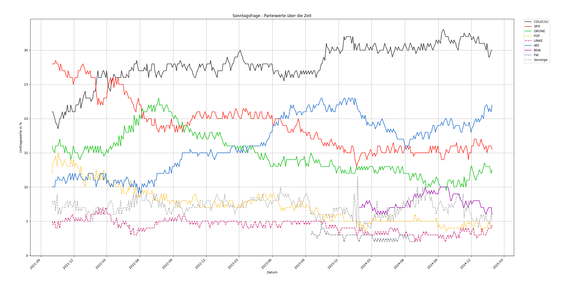
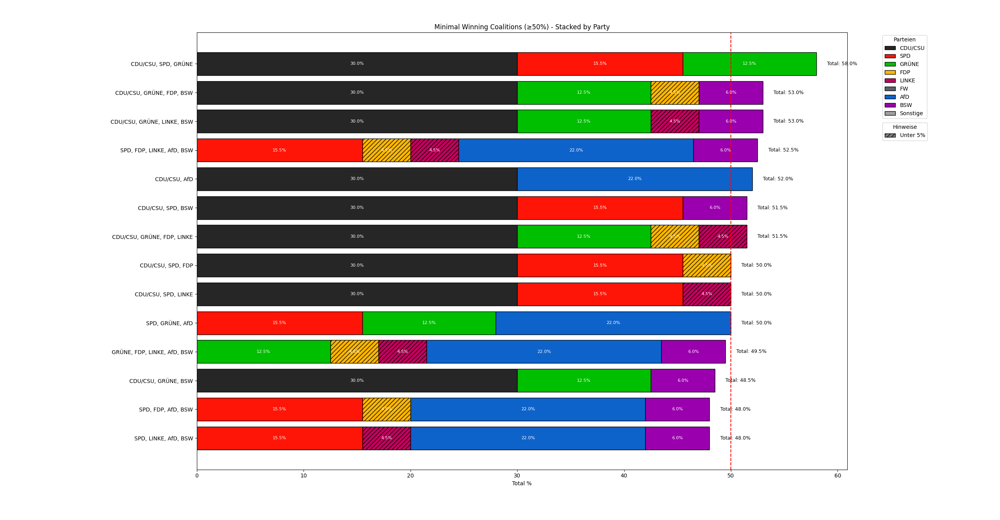
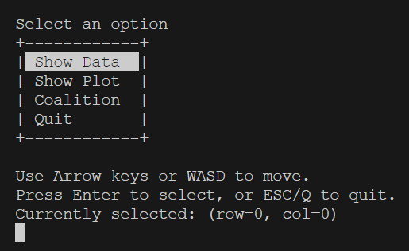
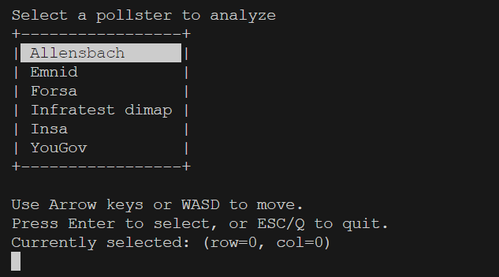

# poll_analyzer

**poll_analyzer** is a Python package that fetches, parses, and analyzes German polling data (Sonntagsfrage) from [wahlrecht.de](https://www.wahlrecht.de). It also includes tools to visualize time-series trends and compute minimal winning coalitions.

---

## Features

- **Data Fetching**: Retrieve poll data directly from [wahlrecht.de](https://www.wahlrecht.de/umfragen/insa.htm).
- **Parsing**: Converts HTML tables into a clean Pandas DataFrame.
- **Visualization**: Plots party percentages over time, highlighting whether a party is below 5%.
  
- **Coalition Analysis**: Calculates minimal winning coalitions based on a user-defined threshold.
  

---

## Installation

You can install **poll_analyzer** locally in **editable mode** by using a `pyproject.toml` file. A sample `pyproject.toml` is provided in the repository.

1. Clone this repo:

```bash
git clone https://github.com/weiserhase/german-poll-analyzer.git
```

2. Move into the project folder and install:

```bash
cd poll_analyzer
pipenv install 
pipenv install -e .  
```
The script can also be build as a windows executable using `pyinstaller`
```bash 
pyinstaller --onefile ./src/poll_analyzer/cli.py
```

3. After installation, you can run the `poll_analyzer` command from your terminal.

---

## Usage

Once installed, you can use the CLI tool by using the built-in selection menu to select the display method and the data source.



## Project Structure

Below is a simplified overview of the repository:

```bash
poll_analyzer/
├── **init**.py
├── utils
│   ├── select_element.py
│   ├── table_printer.py
├── cli.py
├── coalition_analysis.py
├── data_fetcher.py
├── data_parser.py
├── plotter.py
├── config.py
.gitignore
pyproject.toml
README.md
LICENSE
```

- **`cli.py`**: Provides the command-line interface (CLI) entry point.
- **`data_fetcher.py`**: Fetches raw HTML data from wahlrecht.de.
- **`data_parser.py`**: Parses the HTML table into a Pandas DataFrame.
- **`coalition_analysis.py`**: Contains logic for identifying minimal winning coalitions.
- **`plotter.py`**: Creates time series and coalition bar plots using matplotlib.
- **`config.py`**: Stores constants (like party colors) and common helpers.
- **`utils/table_printer.py`**: Provides functions to print a table to the terminal.
- **`utils/select_element.py`**: Provides functions to allow for interactive selections.
- **`pyproject.toml`**: Defines package metadata and dependencies.
- **`README.md`**: This file you are reading.
- **`LICENSE`**: License for this project.

---

## Configuration

You can edit `config.py` to:

- Adjust **PARTY_COLORS** (change or add new party colors).
- Update or add new URLs if you want to fetch data from other sources.

---

## License

This project is licensed under the **GNU GENERAL PUBLIC LICENSE V3**. See the [LICENSE](LICENSE) file for details.

---

## Contributing

Feel free to open issues and submit pull requests. Contributions, suggestions, and bug reports are welcome!

---

**Happy Analyzing!**
